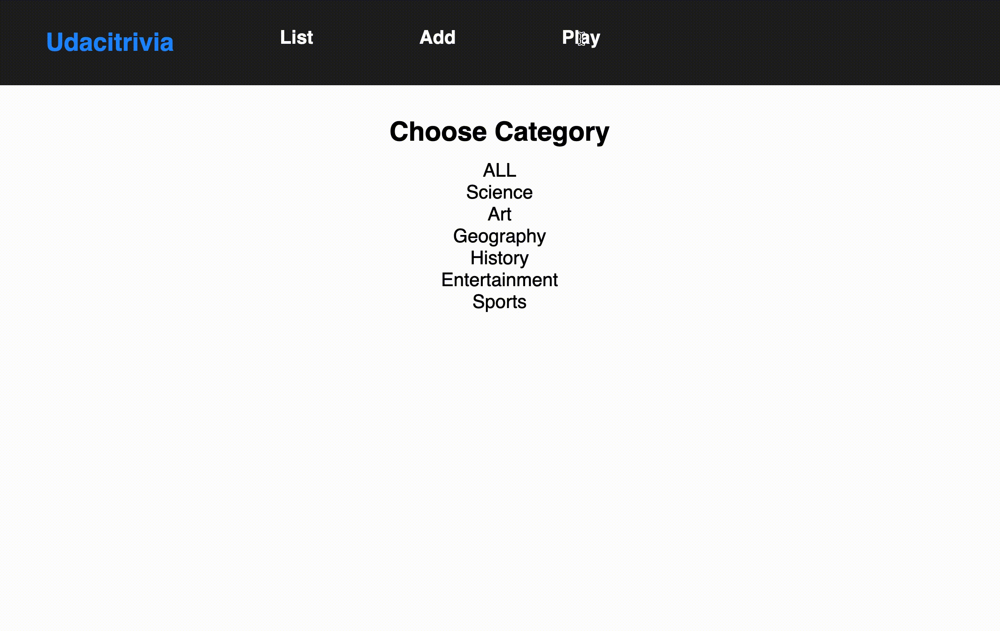

# Full Stack API Final Project

## Full Stack Trivia - Introduction

Udacity is invested in creating bonding experiences for its employees and students. This repo contains code for a fully functioning  webpage to manage the trivia app and play the game.




## Setup / Prerequisites

### Database

## Database Setup
With Postgres running, restore a database using the trivia.psql file provided. From the backend folder in terminal run:
```bash
createdb trivia
psql trivia < trivia.psql
```

### Back End

#### Python 3.7

Follow instructions to install the latest version of python for your platform in the [python docs](https://docs.python.org/3/using/unix.html#getting-and-installing-the-latest-version-of-python)

#### Virtual Enviornment

We recommend working within a virtual environment whenever using Python for projects. This keeps your dependencies for each project separate and organaized. Instructions for setting up a virual enviornment for your platform can be found in the [python docs](https://packaging.python.org/guides/installing-using-pip-and-virtual-environments/)

#### PIP Dependencies

Once you have your virtual environment setup and running, install dependencies by naviging to the `/backend` directory and running:

```bash
pip install -r requirements.txt
```

This will install all of the required packages we selected within the `requirements.txt` file.

##### Key Dependencies

- [Flask](http://flask.pocoo.org/)  is a lightweight backend microservices framework. Flask is required to handle requests and responses.

- [SQLAlchemy](https://www.sqlalchemy.org/) is the Python SQL toolkit and ORM we'll use handle the lightweight sqlite database. You'll primarily work in app.py and can reference models.py.

- [Flask-CORS](https://flask-cors.readthedocs.io/en/latest/#) is the extension we'll use to handle cross origin requests from our frontend server.

### Front End

#### Installing Node and NPM

This project depends on Nodejs and Node Package Manager (NPM). Before continuing, you must download and install Node (the download includes NPM) from [https://nodejs.com/en/download](https://nodejs.org/en/download/).

#### Installing project dependencies

This project uses NPM to manage software dependencies. NPM Relies on the package.json file located in the `frontend` directory of this repository. After cloning, open your terminal and run:

```bash
npm install
```

## API Documentation

### Getting Started

Base URL: https://localhost:3000/

API Keys / Auth: Not required

### Errors

| Code | Text                  | Description                                                                         |
|------|-----------------------|-------------------------------------------------------------------------------------|
| 200  | Ok                    | The request has succeeded                                                           |
| 404  | Not found             | The server can not find the requested resource                                      |
| 405  | Method Not Allowed    | The request method is known by the server but  has been disabled and cannot be used |
| 422  | Unprocessable Entity  | The request was well-formed but was unable to  be followed due to semantic errors.  |
| 500  | Internal Server Error | The server has encountered a situation it doesn't know how to handle.               |

### Resource Endpoint Library

**GET '/categories'**
- Fetches a dictionary of categories in which the keys are the ids and the value is the corresponding string of the category
- Request Arguments: None
- Returns: An object with a single key, categories, that contains a object of id: category_string key:value pairs.
{'1' : "Science",
'2' : "Art",
'3' : "Geography",
'4' : "History",
'5' : "Entertainment",
'6' : "Sports"}

**GET '/questions'**
- Fetches a json object containing a formatted  list of questions as well as how many total questions there are,
and certain diagnostic information related to the API
- Request Arguments: None
- Returns: An object with the keys demonstrated in this
example.
```json
{
"success": true,
"status_code": 200,
"questions": [
{
  "answer": "Apollo 13",
  "category": 5,
  "difficulty": 4,
  "id": 2,
  "question": "What movie earned Tom Hanks his third straight Oscar nomination, in 1996?"
},
{
  "answer": "Tom Cruise",
  "category": 5,
  "difficulty": 4,
  "id": 4,
  "question": "What actor did author Anne Rice first denounce, then praise in the role of her beloved Lestat?"
}
],
"total_questions": 2,
"categories": [
    "Science",
    "Art",
    "Geography",
    "History",
    "Entertainment",
    "Sports"
  ],
"current_category": null
}
```

**DELETE 'questions/\<int:question_id>'**
- Deletes the question with id `question_id`
- Request Arguments: None
- Returns: An object with a the success code and the
id of the question which has just been deleted.
```json
{
 "success": true,
 "deleted": 3
}
```

**POST '/questions'**
- Takes in either a search term or a formatted question and
returns either a object containing a  list of matching questions or an id of a question that was added,
repsectively.
- Request Arguments: search_term; or question,
answer, category, current_category
- Returns: An object of the following form
eg add qustion:
```json
{
 "success": true,
 "status_code": 200,
 "created": 10
}
```

**GET '/categories/<int:category_id>/questions'**
- Fetches a list of questions for a given category id
- Request Arguments: None
- Returns: Example object:
```json
{
  "current_category": "geography",
  "questions": [
    {
      "answer": "Lake Victoria",
      "category": 3,
      "difficulty": 2,
      "id": 13,
      "question": "What is the largest lake in Africa?"
    },
    {
      "answer": "The Palace of Versailles",
      "category": 3,
      "difficulty": 3,
      "id": 14,
      "question": "In which royal palace would you find the Hall of Mirrors?"
    },
    {
      "answer": "Agra",
      "category": 3,
      "difficulty": 2,
      "id": 15,
      "question": "The Taj Mahal is located in which Indian city?"
    }
  ],
  "status_code": 200,
  "success": true,
  "total_questions": 4
}
```


**POST '/quizzes'**
- Fetches a dictionary of categories in which the keys are the ids and the value is the corresponding string of the category
- Request Arguments: previous_questions: a list of questions already asked in this quiz; quiz_category: the category of this quiz
- Returns: The success and status code only if the game
is over, otherwise also a new question.
```json
{
"success": true,
"status_code": 200,
"question":     {
   "answer": "Lake Victoria",
   "category": 3,
   "difficulty": 2,
   "id": 13,
   "question": "What is the largest lake in Africa?"
 }
}
```

## Playing The Game

### Front End

#### Running Your Frontend in Dev Mode

The frontend app was built using create-react-app. In order to run the app in development mode use ```npm start```. You can change the script in the ```package.json``` file.

Open [http://localhost:3000](http://localhost:3000) to view it in the browser. The page will reload if you make edits.<br>

```bash
npm start
```

### Back End

## Running the server

From within the `backend` directory first ensure you are working using your created virtual environment.

To run the server, execute:

```bash
export FLASK_APP=flaskr
export FLASK_ENV=development
flask run
```

## Testing
To run the tests, from within Postgres, run
```
dropdb trivia_test
createdb trivia_test
psql trivia_test < trivia.psql
python test_flaskr.py
```
